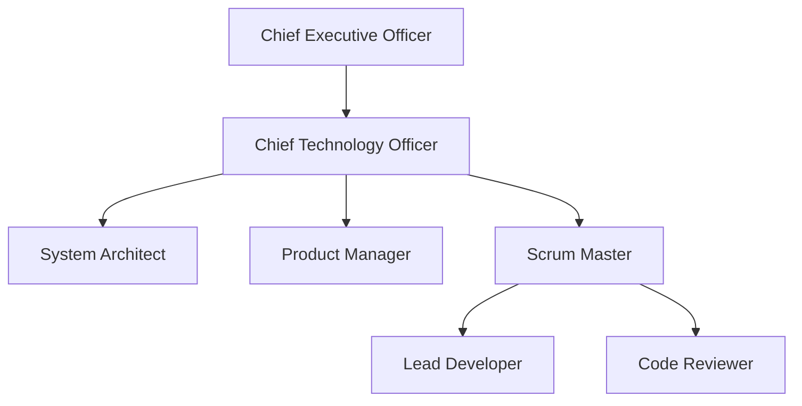

# BMAD Factory

Welcome to the **BMAD Factory**, a hybrid, automated software engineering organization. BMAD Factory is a "Paperclip company" that leverages the BMAD (Breakthrough Method for Agile AI-Driven Development) methodology to build and maintain software autonomously via specialized AI agents.

## Intent and Purpose

The goal of the BMAD Factory is to automate the software development lifecycle by orchestrating specialized AI workers in an agile environment. Instead of a single AI trying to write code from scratch, BMAD Factory assigns specialized roles to different AI agents—from executive planning to coding and review—each using specific BMAD skills to produce structured, high-quality output.

It acts as a complete, self-managing agile team that lives on your local machine and operates directly on your codebase.

## The Agent Workforce

The company operates as a strict agile software factory with distinct roles and handoffs:

1. **CEO (Chief Executive Officer):** Defines the strategic goals, vision, and budgets.
2. **CTO (Chief Technology Officer):** Orchestrates discovery and technical architecture.
3. **Product Manager:** Generates detailed epics, stories, and backlog items.
4. **Scrum Master:** Assigns tickets, monitors sprints, and acts as the traffic cop for the execution team.
5. **Lead Developer:** Writes and implements the code based on strict specifications.
6. **Code Reviewer:** Adversarially audits code quality, boundaries, and edge cases.
7. **Architect:** Ensures that architectural standards and scalability are maintained throughout the process.

### Organizational Structure

## How It Works

The workflow is powered by the [Paperclip](https://github.com/paperclip-ai/paperclip) control plane and the BMAD toolkit:

- Agents orchestrate work via Paperclip issues and assignments.
- Code creation and review utilize `bmad-method` tools directly within the target repository.
- All agents use the `_bmad-output/` directory structure for seamless artifact handoffs (e.g., the Developer writes code based on specs placed there by the Product Manager).

## Quick Start Overview

To run the BMAD Factory:

1. **Start the Control Plane:** Launch the local Paperclip API and web server.
2. **Prep Your Target Codebase:** Navigate to your project (e.g., `my-project`) and install the BMAD toolkit (`npx bmad-method install`).
3. **Import the Company:** Import this `bmad-factory` configuration into Paperclip (`npx paperclipai company import /path/to/bmad-factory`).
4. **Assign Work:** Through the Paperclip dashboard, link your target repository, create a high-level issue, and assign it to the CEO or CTO.

*For detailed, step-by-step instructions, please see the [Operations Manual](OPERATIONS_MANUAL.md).*

## License

This project is licensed under the [MIT License](LICENSE). You are free to use, modify, and distribute this configuration for your own projects.
